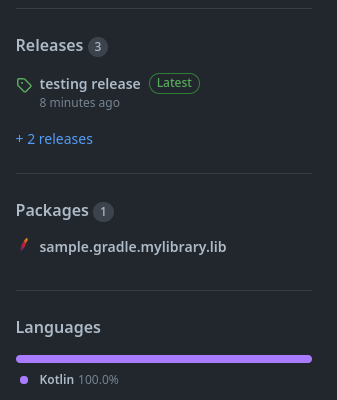

# sample-gradle-package

sampling publish gradle package on github

## General documentation

- <https://docs.gradle.org/current/userguide/build_init_plugin.html#sec:kotlin_library>
- <https://docs.github.com/en/actions/publishing-packages/publishing-java-packages-with-gradle>
- <https://stackoverflow.com/questions/57323260/how-to-push-to-github-package-registry-with-gradle/58206431?stw=2#58206431>
- <https://docs.gradle.org/current/samples/sample_publishing_credentials.html>
- <https://docs.github.com/en/packages/working-with-a-github-packages-registry/working-with-the-gradle-registry#authenticating-with-a-personal-access-token>

## Creating tokens and configuring secrets

- <https://docs.github.com/en/actions/security-guides/encrypted-secrets>
- <https://github.com/settings/tokens/new>
- <https://github.com/<OWNER>/<REPO>/settings/secrets/actions>

## Working workflow (so far)

- manually update `version` inside **lib/build.gradle.kts**
- `git tag` to match `version`
- push new tag to github
- create new release from github

- use the pushed tag for a new release
- that will make the github action kick in

## what can be enhanced

- find a way to make the push tag kick the publish AND the release creation

